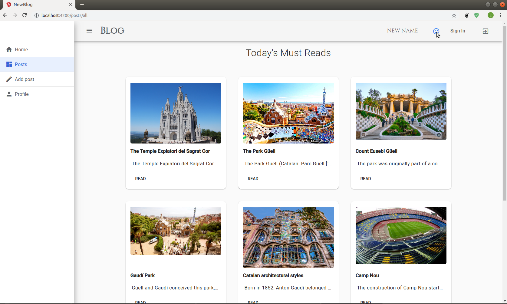

# NewBlog

This project was generated with [Angular CLI](https://github.com/angular/angular-cli) version 6.2.2.

## Development server
Run `npm i` for install project, 
then run `npm run start` and you will go to `http://localhost:4200/`

## Running unit tests

Run `ng test` to execute the unit tests via [Karma](https://karma-runner.github.io).

## Build

Run `ng build` to build the project. The build artifacts will be stored in the `dist/` directory. Use the `--prod` flag for a production build.

## Further help

To get more help on the Angular CLI use `ng help` or go check out the [Angular CLI README](https://github.com/angular/angular-cli/blob/master/README.md).
